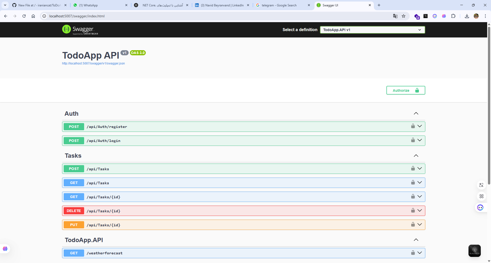

# ✅ ToDoApp

یک پروژه‌ی نمونه برای مدیریت تسک‌ها با معماری **CQRS**، استفاده از **MediatR**، احراز هویت **JWT** و مستندسازی با **Swagger** — توسعه داده شده با ASP.NET Core 8.

---

## 📌 ویژگی‌ها

- معماری تمیز و تفکیک‌شده با **CQRS**
- استفاده از **MediatR** برای مدیریت درخواست‌ها
- احراز هویت با **JWT**
- مستندسازی API با **Swagger**
- ذخیره‌سازی اطلاعات با **Entity Framework Core** و دیتابیس InMemory
- پیاده‌سازی عملیات CRUD برای تسک‌ها
- پشتیبانی از Authorization برای APIهای محافظت‌شده

---

## 📁 ساختار پروژه

```
TodoApp/
│
├── TodoApp.API/            ← Web API و تنظیمات JWT/Swagger
├── TodoApp.Application/    ← CQRS Handlers، Commands، Queries
├── TodoApp.Domain/         ← موجودیت‌ها (Entities) و اینترفیس‌ها
├── TodoApp.Infrastructure/← EF Core، DbContext، Repository
```

---

## 🚀 اجرای پروژه

### پیش‌نیازها:
- [.NET 8 SDK](https://dotnet.microsoft.com/)
- Visual Studio یا VS Code (اختیاری)

### مراحل اجرا:

```bash
git clone https://github.com/your-username/TodoApp.git
cd TodoApp
dotnet run --project TodoApp.API
```

Swagger UI در آدرس زیر قابل دسترسی است:
```
https://localhost:5001/swagger
```

---

## 🔐 احراز هویت JWT

برای تست APIهای محافظت‌شده:

1. با `POST /api/auth/register` ثبت‌نام کنید.
2. با `POST /api/auth/login` توکن دریافت کنید.
3. توکن را در Swagger → دکمه Authorize وارد کنید:
```
Bearer eyJhbGciOiJIUzI1NiIsInR5...
```

---

## 🧱 تکنولوژی‌های استفاده‌شده

- ASP.NET Core 8
- MediatR
- Entity Framework Core (InMemory)
- JWT Authentication
- Swagger (Swashbuckle)
- FluentValidation (در صورت نیاز آینده)

---

## 🙋‍♂️ توسعه‌دهنده

**نوید بیرانوند**  
کارشناس نرم‌افزار، علاقه‌مند به معماری تمیز، توسعه اپلیکیشن‌های کاربردی و یادگیری مداوم.


[LinkedIn](https://www.linkedin.com/in/navid-beyranvand/) | [Email](navid.beyranvand@gmail.com) | [Telegram](https://t.me/iraniancat)

---

## 📌 توسعه‌های آینده

- اتصال به دیتابیس واقعی (SQL Server)
- افزودن نقش‌ها (Role-based Authorization)
- پیاده‌سازی تست‌های واحد (Unit Tests)
- افزودن UI فرانت‌اند (React یا Blazor)

---

## 🖼 اسکرین‌شات

### Swagger UI




---

## 📝 لایسنس

MIT © 2025 Navid
